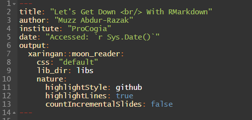
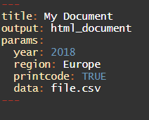
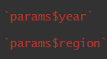
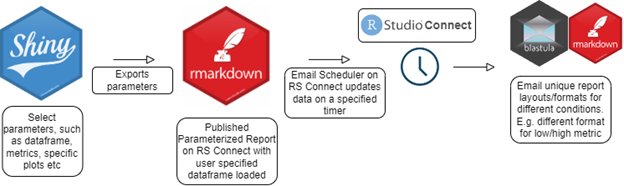
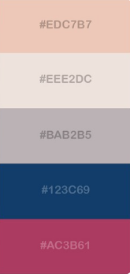

```{r setup, include=FALSE}
options(htmltools.dir.version = FALSE)
```
```{r eval=FALSE, tidy=FALSE, echo=FALSE}
remotes::install_github("yihui/xaringan")
remotes::install_github("gadenbuie/xaringanExtra")
install.packages('DT')
```
```{r xaringan-tile-view, echo=FALSE}
xaringanExtra::use_tile_view()
```
```{r xaringan-animate-css, echo=FALSE}
xaringanExtra::use_animate_css()
```
```{r xaringanExtra, echo = FALSE}
xaringanExtra::use_progress_bar(color = "#0051BA", location = "bottom")
```
```{r xaringan-extra-styles, echo=FALSE}
xaringanExtra::use_extra_styles(
  hover_code_line = TRUE,         #<<
  mute_unhighlighted_code = TRUE  #<<
)
```
```{r xaringan-panelset, echo=FALSE}
xaringanExtra::use_panelset()
```


# What is RMarkdown?
<hr>

- Interactive documents used to create efficient reports to summarize analyses and communicate results to an audience.


--
- It interweaves narrative and prose with code, its outputs, and graphics to create technical documents, that are easily shared, presented, or reproduced.


--
- We can create HTML, PDF, Word documents with R Markdown using only R code, as well as presentations of various types.

--
- This presentation is an rmd!


--
- R Markdown shines in its one-click compiling, or "knitting", making it easy to set up a template document that can accept different parameters.


---
# How is RMarkdown Different?
<hr>

--
- For writers, rmd is often compared to LateX


--
- Easier to write and format based on plain text and markdown.


--
- Very flexible as a 'kitchen knife'


--
- Can include custom LateX packages in your rmd

---
# How is RMarkdown Different?
<hr>

- For programmers, rmd is often compared to Jupyter Notebook


--
- JSON based vs markdown based


--
- Acts better as a logbook, or work file, rather than an interactive report


--
- rmd allows for in-line HTML, css reference files, custom javascript


---

# Output Code Results
<hr>

```{r comment='#'}
# a simple regression
fit = lm(dist ~ 1 + speed, data = cars)
coef(summary(fit))
```

--
- Code chunks with the output included in the document


--
- rmd has language support for all* programming languages

--
```{SQL}
SELECT count(ProductName) AS "Product over $50"
from dbo.Products
where UnitPrice > 50
```

--
- Outputs from interactive code chunks can be stored for later use within the rmd 

--
- Example: live database called on by SQL query, which is sent to and filtered by dplyr, all within your rmd.

---

## Output plots
<hr>

```{r cars, fig.height=4, dev='svg'}
par(mar = c(4, 4, 1, .1))
plot(cars, pch = 19, col = 'darkgray', las = 1)
abline(fit, lwd = 2)
```

---
class: inverse, center, middle

# YAML

---

## YAML
<hr>

- Every rmd has a YAML Header that influences the metadata of the document



--
- These options can include:

  * changing the runtime
  * adding a table of contents
  * adding citations
  * syncing files with bookdown
  * global styling
  * custom parameters

---
class: inverse, center, middle

# Markdown and LateX integration

---

--
# Heading 1
## Heading 2
### Heading 3

**bold text**

*italicized text*

> blockquote

<details>
  <summary style="font-size:=14px"> Toggle example using in-line HTML </summary>
  
  This element is hidden under an HTML toggle
     
</details>


`this is a code snippet`

<hr>

---

You can embed images and links<sup>1<sup>


.footnote[
[1] This is a rare Jelly Toothed mushroom. You can read more about the genus [here](https://en.wikipedia.org/wiki/Pseudohydnum_gelatinosum). 
]
---
# Math Expressions

--
- Historically it has been cumbersome creating a document with complex mathematical equations and formula. RMarkdown allows for simple in-line LateX code

--
- You can write LaTeX math expressions directly into the script. Here is how it appears (which you can hide):

```
$$S(\omega)=1.466\, H_s^2 \,  
\frac{\omega_0^5}{\omega^6}  \, 
e^{\left[-3^{\omega/(\omega_0)}\right]^2}
```
--
This is the output:

$$S(\omega)=1.466\, H_s^2 \,  \frac{\omega_0^5}{\omega^6}  \, e^{\left[-3^{\omega/(\omega_0)}\right]^2}$$

---
class: inverse, center, middle

# Utilizing HTML and Widgets

---
##### HTML Widgets

.panelset[
.panel[.panel-name[Tables]

Here is a basic markdown table. I wanted to first highlight the tabs in the slide.

```{r}
knitr::kable(head(iris), format = 'html')
```
]
.panel[.panel-name[Leaflet Map]

```{r out.width='100%', fig.height=6, eval=require('leaflet')}
library(leaflet)
leaflet() %>% addTiles() %>% setView(-123.11251515934624, 49.2854698409336, zoom = 17)
```
]
.panel[.panel-name[Dynamic Table]

```{r eval=require('DT'), tidy=FALSE}
DT::datatable(
  iris,
  fillContainer = FALSE, options = list(pageLength = 10)
)
```
]
.panel[.panel-name[Other Uses]

- You can also embed Shiny apps directly into your rmd

- In this way, you can create 'lite' apps and simple dashboards

- This is best seen in rmd documents rather than presentations

]
]
---
class: inverse, center, middle 

# Parameterized Reports

---
# Parameterized Reports
<hr>

- You can send custom fields to the params vector in the YAML header


- Those parameters can then be used and called on throughout the rmd



--
- Consider creating a template rmd with all financial analyses, plots, and dashboards dynamically coded.

--
- Passing on a stock ticker in the params field would change the details of the report without any of the structure

---
# Parameterized Reports
<hr>

--
- This is how stand-alone Shiny apps can generate rmd reports based on user sessions 

--


---
class: inverse, center, middle

# CSS

---
# Custom CSS

--
- Front end integration is where rmd and shiny apps really shine

--
- We briefly talked about HTML. Javascript will be next week.

--
- You can create custom themes for corporate branding or your personal brand.

--
.pull-left[


- This is a gelatinous gilled mushroom, part of the Velvet Stalk family

- I think we can make a colour scheme from this!

]

.pull-right[


- This seems close enough 🍄
]

---

class: center, middle

# Thanks!
